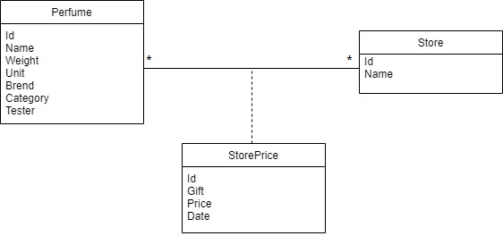
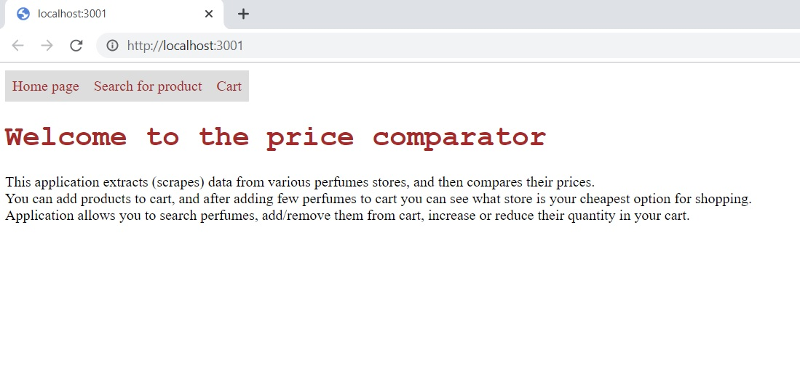
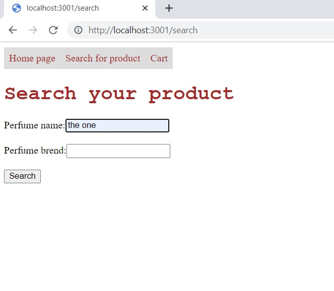
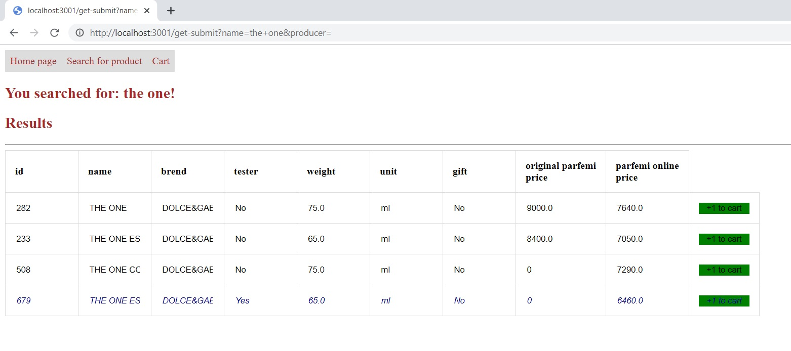
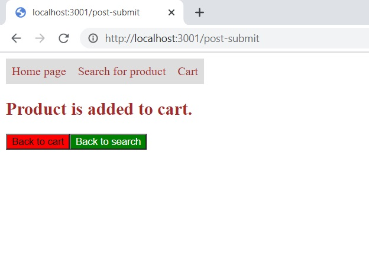
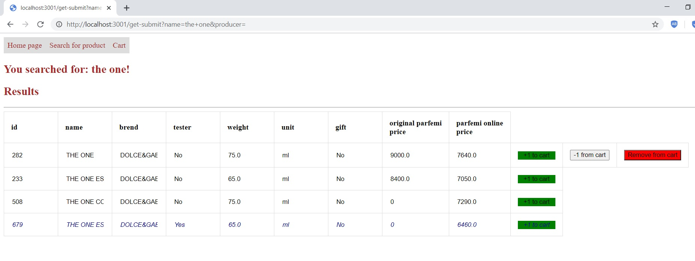
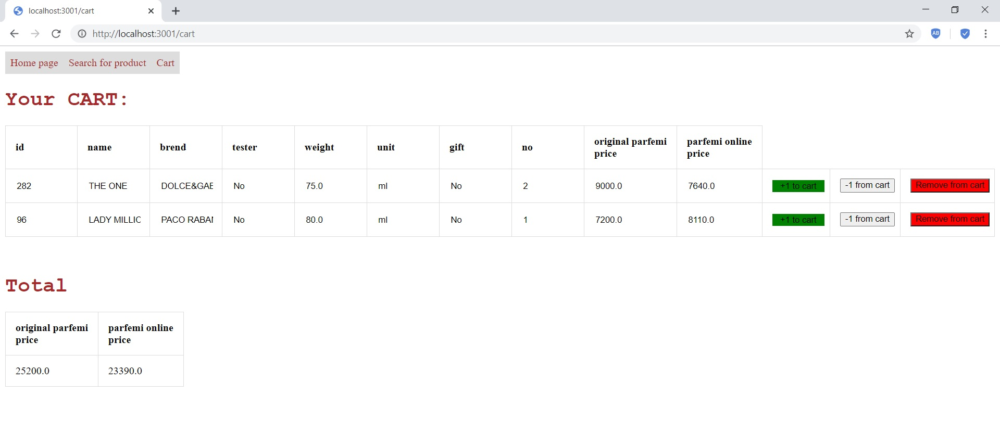
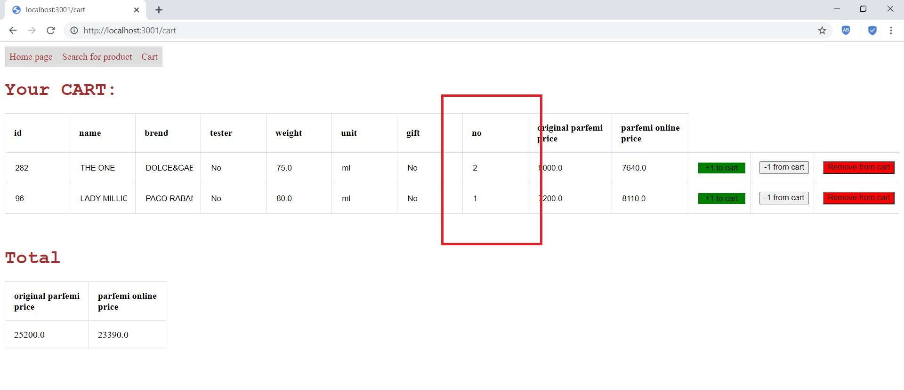
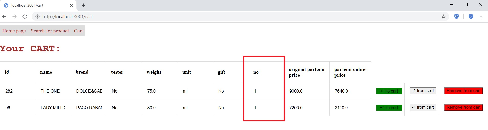
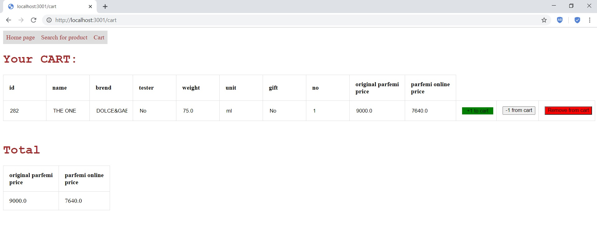

# Perfumes store price comparator

## Description

This application extracts (scrapes) data from various perfumes stores, and then compares their prices.  You can add products to cart, and after adding few perfumes to cart you can see what store is your cheapest option for shopping. 
Application allows you to search perfumes, add/remove them from cart, increase or reduce their quantity in your cart.

### Home page

On this page is short description of project.

### Search

On this page you can search for perfumes by entering perfume's name and/or brend.
When you click search button, results of the search will be shown.
On this page you can add products to the cart.

### Cart

When you finish adding products to cart, you can see your cart on this location and total cart sum.
On this page you can decrease or increase perfume's quantity or remove product from cart.
 

## Structure of project

_SRC folder:_
- db.clj - File for interaction with SQLite database.
- formatscrapeddata.clj - This file contains functions for formatting scrapped perfumes. When perfumes are scrapped from the website they usually contain all of the perfume's information in their name. Functions from this file extract perfume's unit, weight, brand, and other relevant information.
- productsscraping.clj - File for scraping perfume data from website using Reaver.

_Test folder:_ - in this folder are tests for files (db, formatscrapeddata, handler and view).

**Libraries used**

- [Hiccup](https://github.com/weavejester/hiccup) library is used for representing HTML in Clojure.
- [Reaver](https://github.com/mischov/reaver) library is used for for extracting data out of HTML page.
- [java.jdbc](https://github.com/clojure/java.jdbc) Clojure wrapper for JDBC-based access to databases.
- [sqlite-jdbc](https://github.com/xerial/sqlite-jdbc) library for accessing and creating SQLite database files in Java.
- [Ring](https://github.com/ring-clojure/ring) web application library, that is used for abstracting the details of HTTP into API;
- [Compojure](https://github.com/weavejester/compojure) used as routing library for Ring.

## Model

## Screenshots

### Home page

### Search page

### Search results

### Adding to cart

### Search after adding product to cart

### Cart

### Cart before reducing quantity of the product

### Cart after reducing quantity of the product

### Cart after removing product with id 96 from the cart

## Prerequisites

You will need [Leiningen][] 2.0.0 or above installed.

[leiningen]: https://github.com/technomancy/leiningen

## Running

To start a web server for the application navigate to example1 project and run:

    lein ring server

### Scraping data before running server

Before starting server, if you want to scrape perfume store website, you should execute line 101 in file productsscraping.clj. That function creates db, inserts stores to db, scrapes data from defined stores and saves the products to db. If you want to use existing db, that is data scraped on 01.04.2021 just use existing database - database.db.

## License
Eclipse Public License 2.0

Copyright © 2021 Ivona Heldrih
